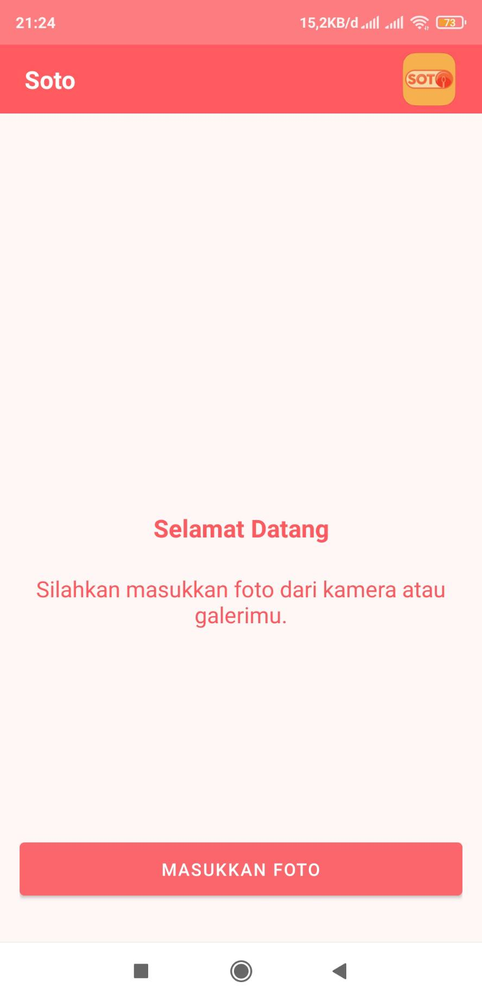
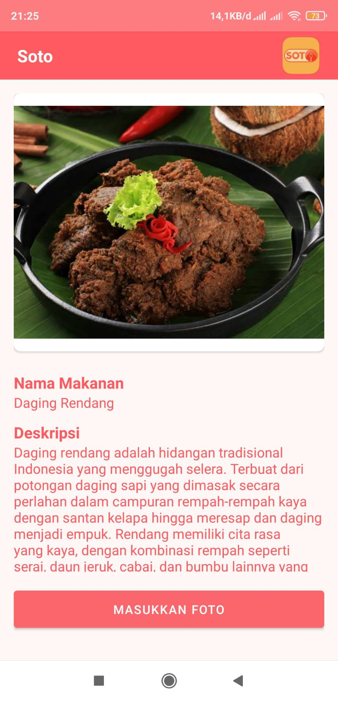
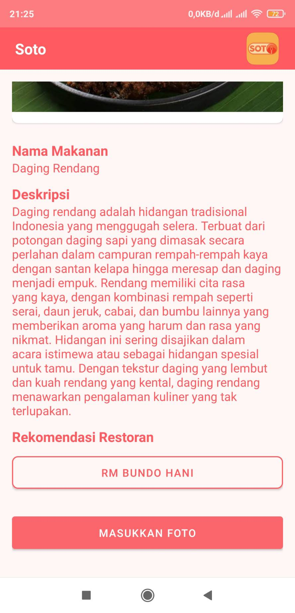

<h1 align="center">
  </img>
 
 
SOTO DEVELOPMENT README
</h1>
<!-- 
 -->

# Team Profile

### Team ID : C23-PS156

### This is our Members

- M017DSX0413	– Faris Tristan Fabian –Institut Teknologi Bandung - Machine Learning
- M350DSX1540 – Bima Maulana – Universitas Sumatera Utara - Machine Learning
- M295DSY2998	– Hanny Adira Putri – Universitas Padjadjaran - Machine Learning  
- C284DKX4819	– Dhival Hazri – Universitas Negeri Medan - Cloud Computing
- C038DSX3266 – Fairuz Azhar Auzan – Institut Teknologi Sepuluh Nopember  - Cloud Computing 
- A017DSX1092	– Muhammad Ammar Murtaqib – Institut Teknologi Bandung - Mobile Development

# Soto Develoment Project
**Mobile Development:**
https://github.com/Soto-Sok-Foto-Bangkit-Capstone/Soto-Mobile-Development

**Machine Learning:**
https://github.com/Soto-Sok-Foto-Bangkit-Capstone/Soto-Machine-Learning

**Cloud:**
https://github.com/Soto-Sok-Foto-Bangkit-Capstone/Soto-Cloud-Computing

**Project Background:**

Indonesia is a vast archipelago country with more than 300 ethnic groups and over 700 different languages spoken across the country. So it is not surprising that Indonesia has a rich culinary heritage that is unique and diverse. And thus making it harder for people to know all of the Indonesian cuisine from different kinds of regions. Additionally, Indonesia has six main culinary traditions based on the different regions, one of those is Sumatra, specifically Padang Cuisine. 

we noticed that Indonesia has lots of traditional foods. That makes it hard to keep track of all of them, even for native Indonesian. Indeed, we can eat the food served to us without having to know the name. But by knowing the name, we can do a lot more than just to eat the dish.

**Solution:**
Our app utilizes machine learning to quickly identify dishes through a simple photo. It will quickly generate the dish name, description of the food and recommended restaurants.

**Case:**

## Screenshots

  
  
  

